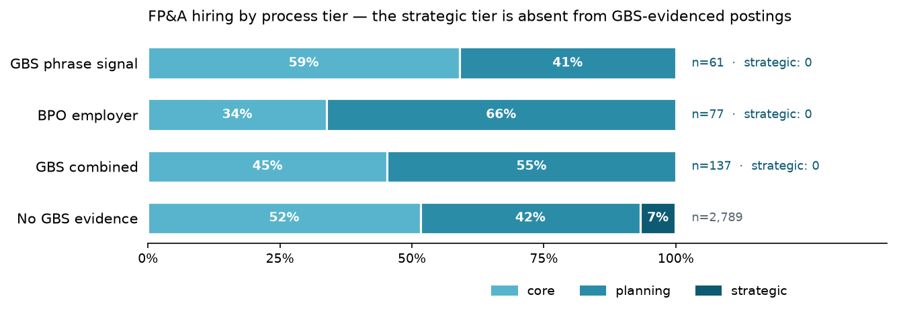

# fpa-gbs-hiring-monitor

**Testing EY's FP&A-in-GBS scope gradient against the live hiring market.**

EY's 2026 survey of FP&A in Global Business Services
([the PDF is public](https://www.ey.com/content/dam/ey-unified-site/ey-com/en-gl/services/consulting/documents/ey-gl-the-state-of-financial-planning-in-global-business-services-in-2026-and-beyond-07-2026.pdf))
reports a scope gradient: the transactional core (cost accounting, financial
analysis, performance reporting) is broadly delivered through GBS, planning
work (budgeting, forecasting) is the declared expansion wave for the next 1–3
years, and the strategic tier stays retained. That is what ~50 companies *say*
about themselves. The hiring market is where an expansion wave is either
visible or not — if planning work is genuinely moving into GBS, GBS-signalled
job postings should be asking for it. This repository reads the claim off live
postings instead of taking it on faith.

## Key finding

**The strategic tier is absent from GBS hiring — 0 of 137 GBS-evidenced FP&A
postings — while planning work is already overrepresented there.** Across
2,926 live FP&A postings in eight markets:

| lens | n | core | planning | strategic |
|---|---|---|---|---|
| GBS phrase signal | 61 | 59% | 41% | **0%** |
| BPO employer | 77 | 34% | 66% | **0%** |
| no GBS evidence | 2,789 | 52% | 42% | 6.6% |



The survey's top-of-pyramid claim (strategy retained: 20% support, +3pt
planned) is exactly what the hiring market shows, and robustly — the
strategic class over-triggers if anything (40% measured precision), so a zero
cannot be a classifier artifact. The planning claim is corroborated
directionally: 54.7% of GBS-evidenced FP&A hiring is planning-tier against
41.7% outside, with the tilt led by third-party providers (66%) rather than
captive centres (41%) — if that split holds, the planning wave is being sold
before it is being built in-house. Planning precision measures 58.3% on a
small gold class, so this share is a direction, not a decimal. Full tables,
market cuts and caveats: [RESULTS.md](RESULTS.md).

## Method

**Population.** Live postings fetched from two sources (Adzuna, Jooble) across
twelve markets — the same country basket as
[gbs-agentic-shift](https://github.com/morichtereur/gbs-agentic-shift), so the
two studies are comparable. Search terms cast for the *function* (FP&A,
financial planning and analysis, budgeting and forecasting, financial analyst,
controlling — the DACH name for FP&A work), never for the delivery model:
whether a posting sits in GBS is measured afterwards, not assumed from the
query.

**Axis 1 — process tier.** A deterministic phrase taxonomy scores every
posting against the survey's own eight processes (financial analysis, cost
accounting, performance reporting, budgeting, forecasting, capex, strategic
planning, M&A support), grouped into the survey's three plateaus. Every label
traces to the exact phrases that produced it. Postings with no process phrase
or a tie between tiers go to an LLM fallback that decides only that residual,
with its reasoning logged.

**Axis 2 — GBS signal.** A posting either names a shared-services / GBS / GCC
/ CoE delivery context or it does not. This axis is deterministic end to end.
Absence of a phrase is **not** evidence a role is retained — employers do not
always name the delivery model — so the split is reported as *visible GBS
signal* vs *no visible signal*, and the GBS share is a lower bound.

**Measurement discipline.** Classifier accuracy is measured against a
hand-labelled gold set stratified across every predicted cell (tier × signal ×
label source), labelled cold — the template shows the text, never the
prediction. Numbers are reported with the measured error, not asserted.

**The comparison, stated honestly.** The survey measures the share of
*companies* whose GBS supports a process; this study measures the share of
*postings* that mention it. Levels are not comparable across the two — only
the ordering. What the hiring market can corroborate or contradict is the
*gradient*: which tiers of FP&A work GBS organizations are actually hiring
for, and whether planning work is overrepresented in GBS-signalled hiring the
way a declared expansion wave implies. A point-in-time cross-section cannot
show a trend.

## Run it

```
make install          # or: pip install -r requirements.txt
cp .env.example .env  # fill in Adzuna, Jooble, Anthropic keys
make all              # fetch -> classify -> analyze
make gold             # draw the stratified gold template
make eval             # score the classifier against eval/gold.csv
make test             # taxonomy unit tests
```

## Related

- [fpa-gbs-companion](https://github.com/morichtereur/fpa-gbs-companion) — the
  survey itself, redrawn as an interactive brief; this study's exhibits feed it.
- [gbs-agentic-shift](https://github.com/morichtereur/gbs-agentic-shift) — the
  same architecture applied to McKinsey's pyramid-to-diamond thesis.

## License

MIT. Posting texts are fetched from public APIs under their terms and are not
redistributed; the repository ships code and aggregates only.
